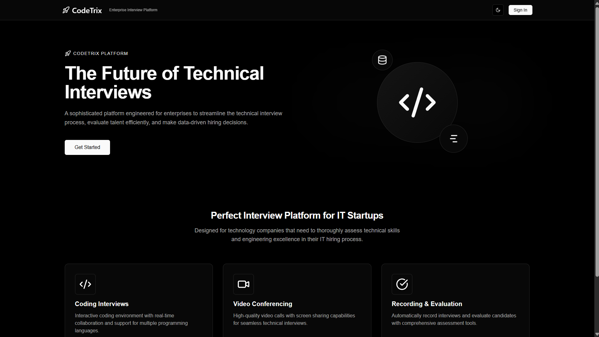

# CodeTrix - IT Interview Platform



CodeTrix is a sophisticated platform engineered for enterprises to streamline the technical interview process, evaluate talent efficiently, and make data-driven hiring decisions.

## 🚀 Features

### 📹 Video Conferencing

- Real-time HD video interviews with minimal latency
- Screen sharing capabilities for collaboration
- Meeting recording for later review
- Customizable layouts (grid and speaker view)

### 💻 Interactive Coding Environment

- Live code editor with syntax highlighting
- Support for multiple programming languages:
  - JavaScript
  - Python
  - Java
  - C++
  - Go
  - Dart
  - C
- Real-time code execution and evaluation

### 📅 Interview Scheduling

- Easy scheduling interface for interviewers
- Calendar integration with customizable time slots
- Automatic notifications and reminders
- Candidate and interviewer management

### 📊 Candidate Evaluation

- Structured feedback collection
- Scoring and rating system
- Interview recordings archive
- Performance analytics and reporting

### 👤 Role-Based Access

- Interviewer role with full features
- Candidate role with restricted access
- Admin dashboard for overall management

## 🛠️ Technology Stack

### Frontend

- **Next.js 15** - React framework for server-side rendering and static site generation
- **React 19** - UI library for building component-based interfaces
- **TailwindCSS** - Utility-first CSS framework
- **shadcn/ui** - Reusable UI components built with Radix UI and Tailwind
- **Monaco Editor** - Code editor that powers VS Code
- **Stream Video SDK** - For video conferencing functionality

### Backend & Data

- **Convex** - Backend-as-a-service for data storage and real-time synchronization
- **Clerk** - Authentication and user management service

### Deployment & Infrastructure

- **Docker** - Containerization for consistent deployment
- **Docker Compose** - Multi-container deployment

## 📋 Prerequisites

- Node.js 18+
- npm or yarn
- Docker and Docker Compose (for containerized deployment)
- Stream.io account for video functionality
- Clerk account for authentication
- Convex account for backend services

## 🚀 Local Development Setup

1. **Clone the repository**

   ```bash
   git clone https://github.com/your-username/codetrix.git
   cd codetrix
   ```

2. **Install dependencies**

   ```bash
   npm install
   # or
   yarn install
   ```

3. **Set up environment variables**
   Create a `.env.local` file in the root directory with the following variables:

   ```
   # Clerk Authentication
   NEXT_PUBLIC_CLERK_PUBLISHABLE_KEY=your_clerk_publishable_key
   CLERK_SECRET_KEY=your_clerk_secret_key
   CLERK_WEBHOOK_SECRET=your_clerk_webhook_secret

   # Stream Video
   NEXT_PUBLIC_STREAM_KEY=your_stream_key
   STREAM_SECRET=your_stream_secret

   # Convex
   NEXT_PUBLIC_CONVEX_URL=your_convex_url
   ```

4. **Start the development server**

   ```bash
   # Start Next.js development server
   npm run dev

   # In a separate terminal, start Convex development server
   npm run convex
   ```

5. **Access the application**
   Open your browser and navigate to `http://localhost:3000`

## 🏗️ Production Deployment

### Using Docker

1. **Build Docker image**

   ```bash
   docker build -t codetrix:latest .
   ```

2. **Run with Docker Compose**
   ```bash
   docker-compose up -d
   ```

### Using Vercel (Recommended)

1. **Deploy to Vercel**

   ```bash
   vercel deploy
   ```

2. **Set environment variables in Vercel dashboard**
   Add all required environment variables in the Vercel project settings.

3. **Configure Convex production deployment**
   Follow the Convex documentation to deploy your backend to production.

## 🧪 Testing

The application doesn't currently have automated tests.

## 🏗️ Project Structure

```
codetrix/
├── actions/               # Server actions
├── app/                   # Next.js application routes
│   ├── (admin)/           # Admin routes
│   └── (pages)/           # Public and authenticated page routes
├── components/            # React components
│   ├── models/            # Business logic components
│   └── ui/                # UI components
├── constants/             # Constant values and data
├── convex/                # Convex backend
│   └── _generated/        # Auto-generated Convex files
├── hooks/                 # Custom React hooks
├── lib/                   # Utility functions
├── providers/             # React context providers
└── public/                # Static assets
```

## 🔑 Key Workflows

### Interview Process

1. Interviewer schedules an interview with a candidate
2. System sends notifications to both parties
3. At the scheduled time, both join the meeting
4. Interviewer conducts the interview using:
   - Video conferencing
   - Code editor for technical assessment
   - Question prompts
5. After interview completion, interviewer rates and provides feedback
6. Admin reviews interview recording and feedback for final decision

### User Roles

#### Interviewer

- Schedule interviews
- Conduct interviews
- Evaluate candidates
- Access interview recordings
- Provide feedback and ratings

#### Candidate

- Join scheduled interviews
- Access coding environment during interview
- View upcoming interview schedule

#### Admin

- Manage users (interviewers and candidates)
- Access dashboard with interview analytics
- Review all interview recordings and feedback

## 📝 License

This project is proprietary and owned by Mohamed Amine Ammar. All rights reserved.

## 📧 Contact

For support or inquiries, contact us at ammar.mohamdamine@gmail.com
